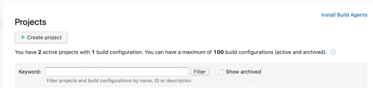
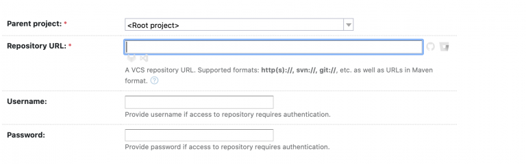
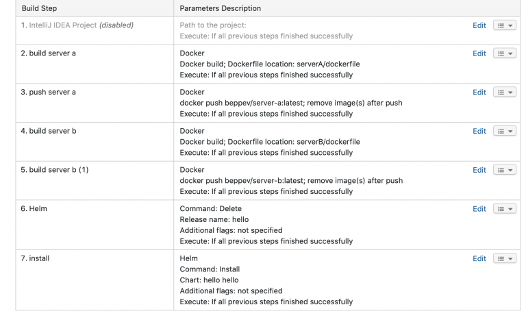

# Kubernetes CI/CD Pipeline (teamcity)

Deze blogpost zal de configuratie voor het opstellen van een kubernetes cicd pipeline via teamcity doorlopen.

Je kan zeer gemakkelijk een teamcity server opstellen via een docker container met de command:

```
docker run -it --name teamcity-server-instance \
-v DATALOCATION:/data/teamcity_server/datadir \
-v LOGSLOCATION:/opt/teamcity/logs \
-p 8080:8111 \
jetbrains/teamcity-server
```

En een agent via de command:

```
docker run -it -e SERVER_URL="SERVERURL" -v /Users/beppe/teamcity/agent/:/data/teamcity_agent/conf jetbrains/teamcity-agent
```

Maar voor deze opdracht werd er zelf een gehost.

Na de installer te downloaden van de site en te unzippen, zorg dat de benodigde requirements op de agent staan. (in ons geval is dit de host pc)

Dit betekend dat we docker (voor images te builden en pushen) zullen installeren en helm installeren (voor kubernetes manifests uit te voeren). Er moet ook een kubernetes config file aanwezig zijn zodat helm weet met welke server hij moet connecteren. (~/.kube/config).

De server runned op poort 8111 (zorg dat deze dus ook toegelaten is in de firewall).

De eerste stap is een nieuw project aanmaken



Daarna configureer je de repository (in ons geval een public git repo https://github.com/beppevanrolleghem/cicdTest)



De laatste stap is de build steps configuren, hier zijn de buildsteps voor dit project:



Het voordeel aan dit systeem is dat developers deze build steps zelf kunnen configureren in hun ide en dat deze zo kunnen overgenomen worden (zie eerste stap die disabled is in dit geval)

## Helm

Voor de eigenlijke deployment gebruiken we helm. Helm is een tool dat gebruikt kan worden om templates van kubernetes manifests te deployen. Door helm install NAAM te runnen kunnen we een helm project genereren (zie GITROOT/hello).

Dit genereerd enkele files, maar de belangrijkste zitten onder hello/template. alle files die daarin staan worden gedeployed op de kubernetes cluster.

## Applicatie

Momenteel is de applicatie die op de kubernetes cluster runned nog zeer simpel, we hebben 2 services en 2 pods. 1 pod wordt via een van de services geexposed via een nodeport, en wanneer deze een request ontvanged contacteert hij via de andere service. Deze server stuurt dan een antwoord en dit antwoord wordt uiteindelijk doorgestuurd naar de user die het eerste request maakte.

Dockerfiles en andere bestanden hiervoor kunnen gevonden worden in de git repo server-a en server-b mappen.


